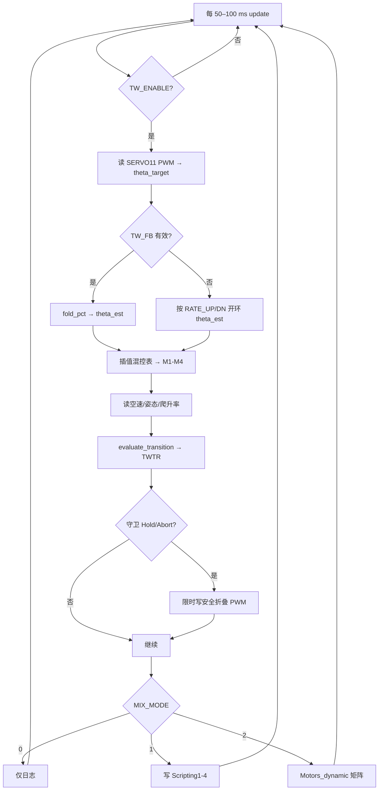

# Transwing Lua 脚本参数与运行说明

本文档说明 `scripts/transwing_dynamic_mix.lua` 创建的 **33 个 `TW_*` 参数**、过渡守卫逻辑、日志格式，以及 SITL / 实机试飞的推荐配置。

**实机固件类型、刷机顺序、AP+TW 完整参数块**见 **`Transwing_实机固件与参数配置.md`**。

脚本名称（GCS 消息前缀）：`TW-DYNMIX`

---

## 1. 脚本做什么

`transwing_dynamic_mix.lua` 在 ArduPilot Lua 脚本框架内完成四件事：

| 功能 | 说明 |
|------|------|
| **折叠角估计** | PWM → `theta_target`；`theta_est` 优先 MAVLink `fold_pct`（`TW_FB_*`），失效时回退 `TW_RATE_*` 开环 |
| **动态混控** | 在 0/15/30/45/60/75/90° 混控表之间插值，计算 M1–M4 的 Lua 混控 PWM |
| **过渡守卫** | 按目标角 + 空速 + 姿态 + 下沉率判断风险，必要时 Hold 折叠角或 Abort 回 Q |
| **DataFlash 日志** | 每周期写 `TWNG`（混控）、`TWTR`（过渡守卫）、`TWAS`（assist 联动） |

**折叠角来源（2026-09）**：`TW_FB_EN=1` 且反馈有效时，`theta_est = fold_pct / 100 × TW_THETA_MAX`（实测角）；超时、`fold_flt=1` 或 `fold_hld=1` 时回退 `TW_RATE_*` 开环。`TW_FB_EN=0` 则始终开环。

协议与接线见 **[Transwing_折叠执行器_MAVLink回传说明.md](./Transwing_折叠执行器_MAVLink回传说明.md)**。`MIX_MODE=2`（CONTROL）在 `TW_FB_REQ=1` 且无有效反馈时会被禁止接管。

---

## 2. 部署前提

### 2.1 必需（ArduPilot 原生，非 TW 表）

| 参数 | 值 | 说明 |
|------|-----|------|
| `SCR_ENABLE` | `1` | 启用 Lua 脚本 |
| 脚本路径 | `APM/scripts/transwing_dynamic_mix.lua` | 上传后**重启飞控** |

脚本首次加载时通过 `param:add_table(91, "TW_", 33)` 创建参数表。Mission Planner → **Full Parameter Tree** 搜索 `TW_` 应看到 33 项。

### 2.2 启动确认

GCS Messages 应出现：

```text
TW-DYNMIX: loaded
TW-DYNMIX: running, mix_mode=0 log_only=1.0 blend=0.00 Motors_dynamic=...
```

---

## 3. 参数总览

脚本默认值来自 `scripts/transwing_dynamic_mix.lua` 中 `param:add_param` 的第四个参数。

**SITL/试飞推荐值**来自 `transwing_sitl_observe.params`（第一阶段）和 `transwing_sitl_mp.params`（动态混控接管）。

| 参数 | 脚本默认 | SITL/试飞推荐 | 分组 |
|------|---------:|--------------:|------|
| `TW_ENABLE` | 1 | 1 | 开关 |
| `TW_LOG_ONLY` | 1 | 1（实测）/ 0（接管） | 开关 |
| `TW_GUARD` | 1 | 1 | 开关 |
| `TW_FOLD_CH` | 10 | 10 | 折叠映射 |
| `TW_PWM_FW` | 2000 | **按实机标定** | 折叠映射 |
| `TW_PWM_Q` | 1000 | **按实机标定** | 折叠映射 |
| `TW_RATE_UP` | 4.5 | 4.5 | 折叠映射 |
| `TW_RATE_DN` | 4.5 | 4.5 | 折叠映射 |
| `TW_TIMEOUT` | 25 | 25 | 折叠映射 |
| `TW_ACCEL_MIN` | 55 | 55 | 过渡守卫 |
| `TW_BLEND_MIN` | 30 | 30 | 过渡守卫 |
| `TW_BLEND_AS` | 13 | **13** | 过渡守卫（20 kg 样机） |
| `TW_FW_AS` | 18 | **18** | 过渡守卫（失速≈18.6 m/s） |
| `TW_SAFE_MIN` | 55 | 55 | 过渡守卫（预留） |
| `TW_ATT_ABORT` | 42 | **42** | 过渡守卫（略高于 ROLL_LIMIT_DEG） |
| `TW_ATT_DANG` | 55 | 55 | 过渡守卫 |
| `TW_DESC_DANG` | -8 | -8 | 过渡守卫 |
| `TW_SAT_PWM` | 1980 | 1980 | 过渡守卫 |
| `TW_GUARD_FBWA` | 1 | 1 | 过渡守卫 |
| `TW_GUARD_MS` | 1000 | 1000 | 过渡守卫 |
| `TW_MIX_MODE` | 0 | 0（实测）/ 2（接管） | 动态混控 |
| `TW_MIX_BLEND` | 0 | 0 | 动态混控 |
| `TW_OUT_GAIN` | 0.2 | 0.2 | 动态混控 |
| `TW_INPUT_SRC` | 1 | 1 | 动态混控 |
| `TW_THR` | 0 | 0 | 台架调试 |
| `TW_ROLL` | 0 | 0 | 台架调试 |
| `TW_PITCH` | 0 | 0 | 台架调试 |
| `TW_YAW` | 0 | 0 | 台架调试 |
| `TW_FB_EN` | 1 | 1 | 折叠反馈 |
| `TW_FB_REQ` | 1 | 1 | 折叠反馈 |
| `TW_FB_STALE` | 1000 | 1000 | 折叠反馈 |
| `TW_THETA_MAX` | 90 | 90 | 折叠反馈 |

---

## 4. 参数详细说明

### 4.1 基础开关

#### `TW_ENABLE`

| 项 | 内容 |
|----|------|
| **含义** | 脚本总开关 |
| **取值** | `0` 关闭；`1` 启用 |
| **行为** | `< 0.5` 时 `update()` 直接返回，不写日志、不守卫、不混控 |
| **实测建议** | 保持 `1`；临时排查可设 `0` 对比 AP 原生行为 |

#### `TW_LOG_ONLY`

| 项 | 内容 |
|----|------|
| **含义** | 是否禁止脚本向电机/Scripting 通道写 PWM |
| **取值** | `1` 只记录；`0` 允许输出 |
| **行为** | `1` 时守卫仍可 Hold `SERVO11` 折叠角；混控结果只进 `TWNG` 日志 |
| **实测建议** | **第一阶段必须 `1`**，确认 TWTR/TWNG 正常后再考虑 `0` |

#### `TW_GUARD`

| 项 | 内容 |
|----|------|
| **含义** | 过渡守卫总开关 |
| **取值** | `0` 关闭 Hold/Abort；`1` 启用 |
| **行为** | 关闭后 `evaluate_transition()` 仍计算并写 `TWTR`，但不改折叠 PWM、不切 Q 模式 |
| **实测建议** | 首次转换试飞保持 `1`；地面标定 PWM 映射时可临时 `0` |

---

### 4.2 折叠角映射与估算

折叠角 **θ** 定义：0° = 固定翼（推力向前），90° = 垂起（推力向上）。

#### `TW_FOLD_CH`

| 项 | 内容 |
|----|------|
| **含义** | 折叠/倾转执行器输出通道号（**零基**） |
| **默认** | `10` → 对应 **SERVO11**（ArduPilot 通道 11 = 零基 10） |
| **代码** | `SRV_Channels:get_output_pwm_chan(fold_chan)` |
| **实测** | 确认 `SERVO11_FUNCTION=41`（TiltMotorsFront）；若折叠舵机接在其他输出，改此值 |

#### `TW_PWM_FW` / `TW_PWM_Q`

| 项 | 内容 |
|----|------|
| **含义** | 固定翼位 / 悬停位的折叠舵机 PWM |
| **映射公式** | `θ = clamp((PWM - TW_PWM_FW) / (TW_PWM_Q - TW_PWM_FW), 0, 1) × 90°` |
| **脚本默认** | `TW_PWM_FW=2000`（0°），`TW_PWM_Q=1000`（90°） |
| **实测** | **必须按实机 `SERVO11_MIN/MAX` 地面标定**，与脚本默认方向一致或交换两者 |

常用参考（当前样机约定）：

| PWM | θ | 阶段 |
|-----|---|------|
| 1000 | 90° | 悬停 |
| 1450 | 55° | `TW_ACCEL_MIN` |
| 1500 | 45° | 混控表节点 |
| 1667 | 30° | `TW_BLEND_MIN` |
| 2000 | 0° | 固定翼 |

若实测方向相反，交换 `TW_PWM_FW` 与 `TW_PWM_Q` 即可，无需改代码。

#### `TW_RATE_UP` / `TW_RATE_DN`

| 项 | 内容 |
|----|------|
| **含义** | 开环估算角 `theta_est` 向目标角逼近的角速度（deg/s） |
| **`RATE_UP`** | 目标角**增大**（向 90° 悬停）时的速率 |
| **`RATE_DN`** | 目标角**减小**（向 0° 固定翼）时的速率 |
| **代码** | `step_theta_estimate(theta_est, theta_target, dt, RATE_UP, RATE_DN)` |
| **标定** | `RATE = 90 / 机构全行程耗时(s)`；当前机构约 20 s → `4.5 deg/s` |
| **与 AP 关系** | 应对齐 `Q_TILT_RATE_UP/DN`，避免飞控指令快于机构实际 |

#### `TW_TIMEOUT`

| 项 | 内容 |
|----|------|
| **含义** | 目标角与估算角偏差报警时间（秒） |
| **触发条件** | `|theta_target - theta_est| > 2°` 且距上次目标变化已超过 `TW_TIMEOUT` |
| **报警** | GCS：`TW-DYNMIX: fold estimate timeout` |
| **实测意义** | 机构卡滞、PWM 映射错误、速率设得过慢时会触发 |

#### `TW_FB_EN` / `TW_FB_REQ` / `TW_FB_STALE` / `TW_THETA_MAX`

| 参数 | 默认 | 含义 |
|------|-----:|------|
| `TW_FB_EN` | 1 | 启用折叠 MAVLink 反馈接收（`NAMED_VALUE_FLOAT` msgid 251） |
| `TW_FB_REQ` | 1 | 无有效反馈时禁止 `MIX_MODE=2` CONTROL 接管电机混控 |
| `TW_FB_STALE` | 1000 | 反馈超时（ms）；超过此时间无任一字段帧则视为失效 |
| `TW_THETA_MAX` | 90 | `fold_pct`（0–100）→ 角度的满行程（deg），与混控表 0…90° 对齐 |

**`theta_est` 双轨逻辑**：

1. **反馈轨**（`TW_FB_EN=1` 且 `fb_ok`）：`theta_est = fold_pct / 100 × TW_THETA_MAX`；同时把开环状态 `theta_ol` 同步为实测角。  
2. **开环轨**（反馈关闭或失效）：`theta_ol = step_theta_estimate(..., TW_RATE_UP/DN)`，`theta_est = theta_ol`。

`fb_ok` 条件：已收到 `fold_pct`、距上次 RX ≤ `TW_FB_STALE`、`fold_flt≠1`、`fold_hld≠1`。

**CONTROL 写舵机**：`MIX_MODE=2` 且守卫 Hold/Abort 时，折叠 PWM 仍由指令角 `theta_cmd_out`（开环 slew）写出，**不用**反馈角直接写舵机。

实机接线与字段语义见 **[Transwing_折叠执行器_MAVLink回传说明.md](./Transwing_折叠执行器_MAVLink回传说明.md)**。

---

### 4.3 过渡守卫

守卫根据 **目标角 `theta_target`**（折叠舵机 PWM 映射）、**空速**、**姿态**、**下沉率**、**电机饱和** 评估风险，必要时：

- **Hold**（`Act=1`）：短时把折叠 PWM 限制在 `Allow` 角
- **Abort**（`Act=2`）：切 `QSTABILIZE`，`Allow=90°`

#### 角度门槛

##### `TW_ACCEL_MIN`（默认 55°）

| 项 | 内容 |
|----|------|
| **含义** | 加速/大角度过渡段的下限 |
| **守卫** | 目标角想 **低于 55°** 且空速 < `TW_BLEND_AS` → **DANGER**，**Hold @ 55°** |
| **55°–90°** 且空速不足 | 仅 **WARN**，不强制 Hold |

##### `TW_BLEND_MIN`（默认 30°）

| 项 | 内容 |
|----|------|
| **含义** | 混合段与固定翼段的分界 |
| **守卫** | 目标角想 **低于 30°** 且空速 < `TW_FW_AS` → **DANGER**，**Hold @ 30°** |

##### `TW_SAFE_MIN`（默认 55°）

| 项 | 内容 |
|----|------|
| **含义** | **Q assist 联动时的折叠/混控保持角**（`TW_ASST_EN=1`） |
| **行为** | AP assist 激活且目标角 < 此值 → Hold 折叠 PWM，混控矩阵按此角加载 |
| **建议** | 与 `TW_ACCEL_MIN` 对齐（默认 55°） |

##### `TW_ASST_EN`（默认 1）

| 项 | 内容 |
|----|------|
| **含义** | 是否将 AP `Q_ASSIST` 与 Lua 守卫/混控联动 |
| **检测** | 优先 `quadplane:in_assisted_flight()`；否则 AS < `Q_ASSIST_SPEED` 且非 Q 模式 |
| **0** | 仅 AP 原生 assist，Lua 不强制折叠 Hold / 混控角 |
| **1** | assist 时 Hold @ `TW_SAFE_MIN`，`Motors_dynamic` 用 ≥ `TW_SAFE_MIN` 的因子表 |

#### Q assist 与 Lua 联动示意

```text
AP: AS < Q_ASSIST_SPEED(16) → assist 介入（升力/稳定）
Lua (TW_ASST_EN=1):
  · 读 quadplane:in_assisted_flight() 或空速回退
  · 目标角 < TW_SAFE_MIN(55°) → Hold 折叠 + 混控 θ ≥ 55°
  · 日志 TWAS: Act, Hold, MixT, AsSpd
  · 不覆盖 ABORT_TO_Q（姿态/下沉 Abort 优先）
```

#### 空速门槛

##### `TW_BLEND_AS`（脚本默认 13，推荐 13 m/s）

| 项 | 内容 |
|----|------|
| **含义** | 混合段（约 30°–90°）继续往小角度转所需的最低空速 |
| **日志** | `blend airspeed X.X<13.0` 或 `accel airspeed ...` |

##### `TW_FW_AS`（脚本默认 18，推荐 18 m/s）

| 项 | 内容 |
|----|------|
| **含义** | 进入固定翼段（θ < `TW_BLEND_MIN`）所需的最低空速 |
| **日志** | `fixed-wing airspeed X.X<18.0` |

**守卫分段示意**（90° → 0°）：

```text
90° ───────── 悬停
     │  ≥55°：AS < BLEND_AS → WARN
55° ─┼──────── ACCEL_MIN；AS 不足 → Hold@55°
     │  30°–55°：需 AS ≥ BLEND_AS
30° ─┼──────── BLEND_MIN；AS 不足 → Hold@30°
     │  <30°：需 AS ≥ FW_AS
 0° ───────── 固定翼
```

SITL 日志实测（`00000023.BIN`）：55° Hold 时空速约 10.8–12.0 m/s；45° 附近约 16–17.6 m/s。

#### 姿态与下沉

##### `TW_ATT_ABORT`（脚本默认 42°，推荐 42°）

| 滚转或俯仰绝对值超过此值 | 计入 `attitude_abort`，触发 DANGER |

建议设为略高于 `ROLL_LIMIT_DEG`（默认 40°），避免 FBWA 正常坡度误触发 Abort。

##### `TW_ATT_DANG`（默认 55°）

| 超过此值但未达 ABORT | 计入 `attitude_danger`，仍 DANGER |

##### `TW_DESC_DANG`（默认 -8 m/s）

| 项 | 内容 |
|----|------|
| **含义** | 滤波后爬升率低于此值视为危险下沉 |
| **持续判定** | 低于阈值持续 **0.4 s**（代码常量 `DESC_SUSTAIN_S`）算 sustained |
| **严重下沉** | < `DESC_DANG × 1.5`（-12 m/s）立即触发 abort 链 |

##### `TW_SAT_PWM`（默认 1980）

| 任一电机 PWM ≥ 此值，或差动饱和 | 视为 saturation，DANGER |

#### 守卫行为微调

##### `TW_GUARD_FBWA`（默认 1）

| 项 | 内容 |
|----|------|
| **含义** | FBWA 模式下低空速姿态异常时的特殊处理 |
| **条件** | FBWA 且 AS < `TW_BLEND_AS` 且仅姿态 abort（非下沉/饱和） |
| **行为** | **Hold** 在安全角，**不 Abort 回 Q** |
| **实测** | 转换建议用 **FBWB** 而非 FBWA；此参数减轻 FBWA 误 abort |

##### `TW_GUARD_MS`（默认 1000 ms）

| Hold/Abort 时写入折叠 PWM 的 `set_output_pwm_chan_timeout` 持续时间 |

#### 上电保护（代码常量，非参数）

| 常量 | 值 | 含义 |
|------|-----|------|
| `BOOT_GUARD_GRACE_S` | 15 s | 上电后 15 s 内 |
| `BOOT_GUARD_MAX_AS` | 3 m/s | 且空速 < 3 m/s 时，守卫暂不生效 |

---

### 4.4 动态混控

#### `TW_MIX_MODE`

| 值 | 名称 | 行为 |
|----|------|------|
| `0` | OBSERVE | 只算混控、写日志；**不改任何输出**（`LOG_ONLY=1` 时） |
| `1` | MIRROR | 把 Lua M1–M4 写到 **Scripting1–4**（Function 94–97，通常 SERVO13–16） |
| `2` | CONTROL | 通过 **`Motors_dynamic`** 接管 Motor1–4 混控矩阵 |

**注意**：若 `TW_LOG_ONLY=0` 且 `MIX_MODE=0`，脚本自动升为 MIRROR 模式。

#### `TW_MIX_BLEND`（0–1）

| 项 | 内容 |
|----|------|
| **生效条件** | `MIX_MODE=2` 且 `Motors_dynamic` 不可用时的 PWM 混合回退 |
| **含义** | `0` = 全 Lua 计算 PWM；`1` = 全 AP 实际 PWM |
| **正常路径** | `Q_FRAME_CLASS=17` 时走 `Motors_dynamic`，不依赖此混合 |

#### `TW_OUT_GAIN`（默认 0.2）

混控公式中姿态修正量（roll/pitch/yaw）的增益，限制在 0–1。

#### `TW_INPUT_SRC`

| 值 | 含义 |
|----|------|
| `0` | 使用 `TW_THR/ROLL/PITCH/YAW` 参数作为混控输入 |
| `1` | 从 RC 读取：CH3 油门，CH1/2/4 杆量（**实测默认**） |

---

### 4.5 台架调试输入

仅在 `TW_INPUT_SRC=0` 时使用：

| 参数 | 范围 | 含义 |
|------|------|------|
| `TW_THR` | 0–1 | 油门 |
| `TW_ROLL` | -1–1 | 滚转 |
| `TW_PITCH` | -1–1 | 俯仰 |
| `TW_YAW` | -1–1 | 偏航 |

实机试飞保持 `TW_INPUT_SRC=1`，无需改这四个参数。

---

## 5. 过渡相位（TWTR.Phase）

由 **估算角 `theta_est`** 划分，仅用于日志：

| Phase | 名称 | 角度范围（θ_est） |
|------:|------|-------------------|
| 0 | HOVER | > 75° |
| 1 | ACCEL | ≥ `TW_ACCEL_MIN`（55°）且 ≤ 75° |
| 2 | BLEND | ≥ `TW_BLEND_MIN`（30°）且 < 55° |
| 3 | FIXED_WING | < 30° |

---

## 6. DataFlash 日志

### 6.1 `TWNG`（混控）

| 字段 | 含义 |
|------|------|
| `Targ` | 目标折叠角 θ（deg） |
| `Est` | 估算折叠角 θ（deg）；反馈有效时为实测角，否则为开环估计 |
| `Fold` | 折叠舵机 PWM |
| `M1`–`M4` | Lua 计算的混控 PWM |
| `A1`–`A4` | AP 实际 Motor1–4 PWM |

对比工具：

```bash
python tools/compare_twng_rcou.py path/to/log.BIN
```

### 6.2 `TWTR`（过渡守卫）

| 字段 | 含义 |
|------|------|
| `Targ` / `Est` / `Allow` | 目标角 / 估算角 / 守卫允许角（deg） |
| `Phase` | 过渡相位 0–3 |
| `Risk` | 0=OK，1=WARN，2=DANGER |
| `AS` | 空速（m/s） |
| `Roll` / `Pitch` | 姿态（deg） |
| `Climb` | 滤波爬升率（m/s） |
| `Sat` | 电机饱和 0/1 |
| `Act` | 0=ALLOW，1=HOLD，2=ABORT_TO_Q |

### 6.3 `TWFB`（折叠反馈）

| 字段 | 含义 |
|------|------|
| `Pct` | 板端 `fold_pct`（0–100） |
| `Cnt` | 板端 `fold_cnt`（编码器计数） |
| `Flt` | 舵机故障闩锁（0 正常 / 1 故障） |
| `Hld` | HOLD 状态（0 跟控 / 1 HOLD） |
| `Ok` | 反馈是否有效（1=用于 `theta_est`） |
| `Src` | 角来源标记（1=反馈，0=开环） |

### 6.4 `TWAS`（assist 联动）

| 字段 | 含义 |
|------|------|
| `Act` | AP assist 激活 0/1 |
| `Hold` | 守卫允许角（deg），assist 时可能 ≥ `TW_SAFE_MIN` |
| `MixT` | 动态混控使用的 θ（deg）；assist 时 ≥ `TW_SAFE_MIN` |
| `AsSpd` | `Q_ASSIST_SPEED` 参数值（m/s） |

---

## 7. 与 ArduPilot 原生参数的配合

Lua **不替代**以下 AP 参数，实测需一并配置：

| 参数 | 第一阶段建议 | 说明 |
|------|-------------|------|
| `Q_ENABLE` | 1 | QuadPlane |
| `Q_FRAME_CLASS` | **1**（实测）/ **17**（Lua 混控接管） | 1=原生混控；17=Motors_dynamic |
| `Q_TILT_ENABLE` | 1 | 倾转/折叠 |
| `Q_TILT_MASK` | 15 | 四电机参与 |
| `Q_TILT_MAX` | **90** | 原生倾转上限；设太小会提前卡住（如 30→约 60°） |
| `Q_TILT_RATE_UP/DN` | 4.5 | 对齐 `TW_RATE_UP/DN` |
| `SERVO11_FUNCTION` | 41 | 折叠作动器 |
| `ROLL_LIMIT_DEG` | 40 | FBWA 最大横滚 |
| `SCR_ENABLE` | 1 | Lua |

更完整的通道与 QuadPlane 配置见 `ArduPilot_QuadPlane_TiltRotor_参数配置.md`。

---

## 8. 推荐配置方案

### 8.1 实机第一阶段（只守卫 + 记录，安全）

文件：`transwing_sitl_observe.params`（实机同样适用）

```text
SCR_ENABLE,1
Q_FRAME_CLASS,1

TW_ENABLE,1
TW_LOG_ONLY,1
TW_MIX_MODE,0
TW_INPUT_SRC,1
TW_GUARD,1

TW_FOLD_CH,10
TW_PWM_FW,2000          # 按实机标定
TW_PWM_Q,1000
TW_RATE_UP,4.5
TW_RATE_DN,4.5

TW_ACCEL_MIN,55
TW_BLEND_MIN,30
TW_BLEND_AS,13
TW_FW_AS,18
TW_ATT_ABORT,42
TW_ATT_DANG,55
TW_DESC_DANG,-8
TW_GUARD_FBWA,1
TW_GUARD_MS,1000

TW_FB_EN,1
TW_FB_REQ,1
TW_FB_STALE,1000
TW_THETA_MAX,90
```

### 8.2 SITL / 后期动态混控接管

文件：`transwing_sitl_mp.params`

在 8.1 基础上：

```text
Q_FRAME_CLASS,17
TW_LOG_ONLY,0
TW_MIX_MODE,2
Q_TILT_MAX,90
```

需要 AP 支持 `Motors_dynamic`（`Q_FRAME_CLASS=17`）。

### 8.3 镜像对比（SITL 台架）

```text
TW_MIX_MODE,1
TW_LOG_ONLY,0
SERVO13_FUNCTION,94
SERVO14_FUNCTION,95
SERVO15_FUNCTION,96
SERVO16_FUNCTION,97
```

Lua 输出到 Scripting1–4，**不改变 SERVO1–4 电机输出**。

---

## 9. 实测检查清单

### 9.1 地面

1. 上传脚本，`SCR_ENABLE=1`，重启。
2. MP 搜索 `TW_`，确认 33 个参数存在。
3. 手动/Q 模式动 `SERVO11`，看 `TWNG.Targ` 是否 0°–90° 变化合理。
4. 核对 `TW_PWM_FW/Q` 与 `SERVO11_MIN/MAX` 一致。

### 9.2 悬停

1. `TW_LOG_ONLY=1`，`TW_GUARD=1`。
2. QSTABILIZE 悬停，确认 `TWTR` 有数据，`Act=0`。

### 9.3 转换

1. 空速 ≥ 13 m/s 再启动转换；推荐 **FBWB**。
2. 观察 GCS：`TW-DYNMIX: guard reason=...`。
3. 下载日志，查 `TWTR` 在 55°/30° 的 `AS` 与 `Act`。

### 9.4 不建议首飞打开

| 组合 | 原因 |
|------|------|
| `TW_MIX_MODE=2` + 实机 | 需先完成 TWNG vs AP 对比 |
| `TW_LOG_ONLY=0` 且无隔离 | 脚本可能写电机 PWM |
| `TW_GUARD=0` | 失去过渡保护 |

---

## 10. 脚本主循环概要



---

## 11. 相关文件

| 文件 | 说明 |
|------|------|
| `scripts/transwing_dynamic_mix.lua` | 脚本源码 |
| `Transwing_折叠执行器_MAVLink回传说明.md` | F103 执行器 MAVLink 回传与 `TW_FB_*` 对接 |
| `transwing_sitl_observe.params` | 实测/观察配置 |
| `transwing_sitl_mp.params` | SITL 混控接管配置 |
| `ArduPilot_QuadPlane_TiltRotor_参数配置.md` | AP 原生 QuadPlane 参数 |
| `docs/transwing_coordinate_chain.md` | 坐标链与守卫设计说明 |
| `tools/peek_latest_twtr.py` | 查看最新 TWTR |
| `tools/analyze_fold_stuck.py` | 分析折叠卡住 |
| `tools/compare_twng_rcou.py` | Lua vs AP 电机输出对比 |

---

## 12. 已知限制

1. **反馈失效时仍开环**：`TW_FB_STALE` 超时或 `fold_flt`/`fold_hld` 时 `theta_est` 回退速率估计；实机应监控 `TWFB.Ok`。
2. **`TW_FB_REQ=1` 时无反馈不可 CONTROL**：`MIX_MODE=2` 会降为 MIRROR，需先确认 `TWFB.Ok=1` 再接管。
3. **守卫 Hold 与 AP 原生倾转并存**：需协调 `Q_TILT_MAX` 与 Lua 门槛。
4. **动态混控与 AP 原生输出可能不一致**：日志中 M1–M4 与 A1–A4 常有较大偏差，接管前必须对比验证。
5. **CONTROL 写折叠舵机仍用指令 slew 角**：反馈只影响 `theta_est`/混控/守卫，不直接写 PWM。

---

## 13. 本地数学测试

```bash
node --test transwing_lua_mix_model.test.mjs
```

与 Lua 共用同一套 0/15/30/45/60/75/90° 混控表逻辑，用于离线验证插值与角度估算。
