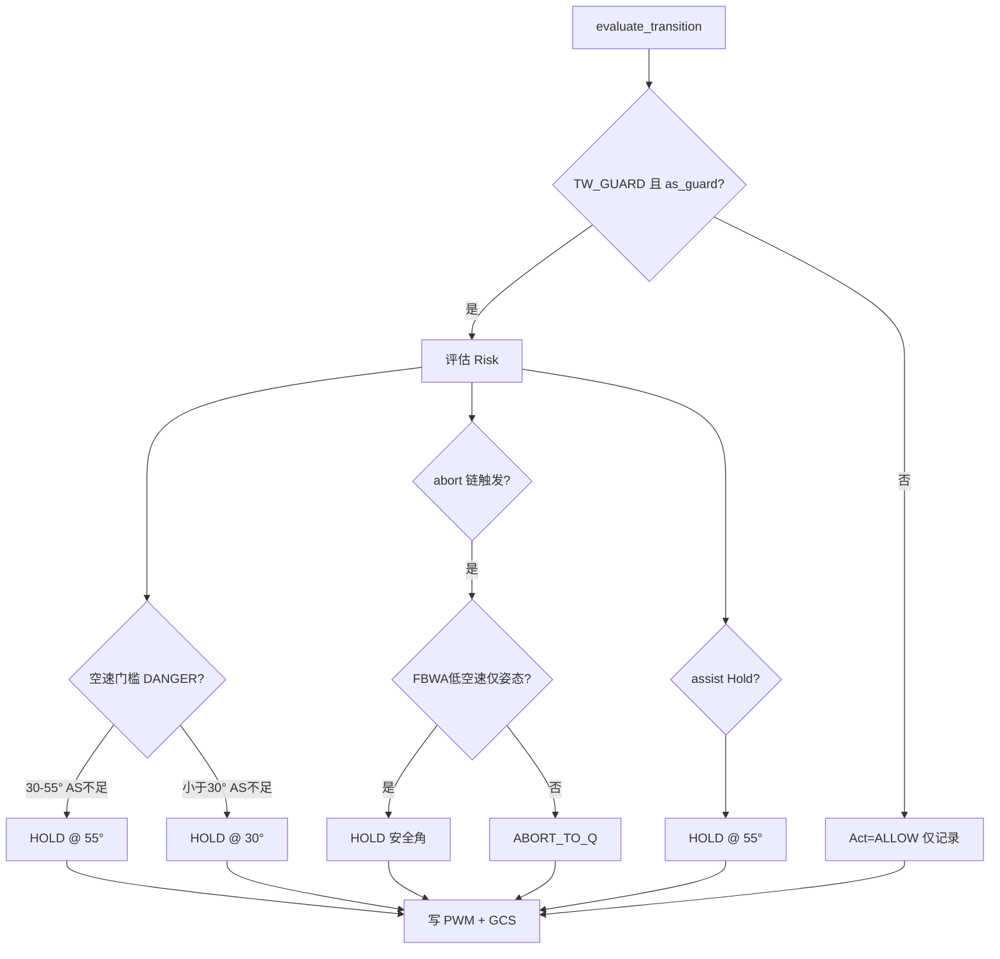

# Transwing 守卫动作说明

本文档说明 `scripts/transwing_dynamic_mix.lua` 过渡守卫输出的三种**守卫动作**（`TWTR.Act`）：含义、触发条件、脚本实际行为及飞行员应对。

**相关文档**：`Transwing_模式转换与保护说明.md`、`Transwing_Lua_动态混控仿真说明.md`

---

## 1. 概述

过渡守卫每 **50–100 ms** 调用 `evaluate_transition()` 评估一次，根据目标折叠角、空速、姿态、下沉率、电机饱和等输入，输出：

| 输出 | 日志字段 | 含义 |
|------|----------|------|
| 允许角 | `TWTR.Allow` | 守卫允许折叠到达的角度（deg） |
| 动作 | `TWTR.Act` | 0 / 1 / 2 |
| 风险 | `TWTR.Risk` | 0=OK，1=WARN，2=DANGER |
| 原因 | GCS 文本 | `TW-DYNMIX: guard reason=...` |

**生效前提**

| 条件 | 说明 |
|------|------|
| `TW_GUARD=1` | 守卫总开关；`0` 时只写 TWTR，**不 Hold、不 Abort** |
| `as_guard` 有效 | 空速 ≥ 3 m/s，或上电已超过 15 s |
| `TW_ENABLE=1` | 脚本总开关 |

---

## 2. 三种守卫动作一览

| Act | 名称 | 含义 | 对折叠机构 | 对飞行模式 |
|----:|------|------|------------|------------|
| **0** | **ALLOW** 允许 | 一切正常，AP 继续驱动折叠 | 不干预 | 不切换 |
| **1** | **HOLD_THETA** 保持角度 | 暂时阻止折叠继续往危险方向转 | 限时写入 `Allow` 角 PWM | 不切换 |
| **2** | **ABORT_TO_Q** 中止回垂起 | 转换失败，退回安全构型 | 限时写入 **90°** PWM | 切 **QSTABILIZE** |

代码定义（`scripts/transwing_dynamic_mix.lua`）：

```lua
local ACTION = { ALLOW = 0, HOLD_THETA = 1, ABORT_TO_Q = 2 }
```

---

## 3. ALLOW（允许）

### 3.1 含义

**默认状态**。守卫认为当前可以继续转换，不干预 AP 对折叠机构的控制。

### 3.2 脚本行为

- AP 在 FBWB 下继续命令折叠向 0°，或在 Q 模式下向 90°
- Lua **不修改** `SERVO11`（`TW_FOLD_CH`）折叠 PWM
- `TWTR.Act = 0`，`Allow` 通常等于 `Targ`（目标角）
- 无 GCS 守卫告警（若此前有告警且原因已消除，告警清除）

### 3.3 典型场景

- 空速满足当前过渡段要求
- 姿态、爬升率、电机输出均在安全范围
- 55°–90° 段空速略低时可能 `Risk=WARN`，但 **Act 仍为 ALLOW**（只警告，不 Hold）

---

## 4. HOLD_THETA（保持角度）

### 4.1 含义

**「慢下来，别继续往危险方向转」** — 比 Abort 温和的保护：锁定折叠角，给飞行员时间攒空速或恢复姿态，**不强制回 Q**。

### 4.2 脚本行为

当 `Act ≠ ALLOW` 且 `TW_GUARD=1` 时（`MIX_MODE≠CONTROL` 或非 slew 路径）：

```lua
local safe_pwm = theta_to_pwm(allowed_theta, pwm_fw, pwm_q)
local guard_ms = math.max(100, math.floor(P.GUARD_MS:get() + 0.5))
SRV_Channels:set_output_pwm_chan_timeout(fold_chan, safe_pwm, guard_ms)
```

| 项 | 说明 |
|----|------|
| PWM 写入 | 折叠舵机限时锁定在 `Allow` 角对应 PWM |
| 超时 | `TW_GUARD_MS`，默认 **1000 ms**（每周期刷新） |
| 飞行模式 | **不切换**，飞行员仍可加油门 |
| GCS | `TW-DYNMIX: guard reason=...` |

`MIX_MODE=2`（CONTROL）且 fold slew 激活时，由 Lua 直接 slew 折叠到 `Allow` 角，而非 timeout 写 PWM。

### 4.3 触发场景

| 场景 | Allow 角 | 参数 | 飞行员应对 |
|------|----------|------|------------|
| 目标在 30°–55°，空速不足 | **55°** | `TW_ACCEL_MIN`，AS < `TW_BLEND_AS`（11 m/s） | 加油门至 ≥11 m/s |
| 目标 < 30°，空速不足 | **30°** | `TW_BLEND_MIN`，AS < `TW_FW_AS`（15 m/s） | 继续加速至 ≥15 m/s |
| Q Assist 激活，目标 < 55°，AS < 11 | **55°** | `TW_SAFE_MIN`，`TW_ASST_EN=1` | 攒速或等待 assist 退出 |
| FBWA 低空速，仅姿态异常 | 55° 或 30° | `TW_GUARD_FBWA=1` | 改 FBWB 或恢复姿态 |

### 4.4 与 WARN 的关系

assist 联动 Hold 时，若原 `Risk=OK`，会升为 `Risk=WARN`，但 `Act=HOLD_THETA`。

空速门槛 Hold 时 `Risk=DANGER`，但动作是 Hold 而非 Abort — **空速不足一般不回 Q**。

---

## 5. ABORT_TO_Q（中止回垂起）

### 5.1 含义

**「转换失败，立即回安全构型」** — 最强保护：折叠回悬停位并强制进入 Q 模式。

### 5.2 脚本行为

除 Hold 的 PWM 写入外：

```lua
if action == ACTION.ABORT_TO_Q and vehicle ~= nil then
  pcall(function() vehicle:set_mode(17) end)  -- QSTABILIZE
end
```

| 步骤 | 行为 |
|------|------|
| 1 | `Allow = 90°`，折叠 PWM 指向悬停位 |
| 2 | 调用 `vehicle:set_mode(17)` 切 **QSTABILIZE** |
| 3 | GCS 告警：`TW-DYNMIX: guard reason=...` |

### 5.3 触发条件（abort 链）

需同时满足：

1. `Risk = DANGER`
2. 目标角 `Targ < 90°`（正在向前飞转换）
3. 存在 **abort_trigger** 之一：

| 因素 | 默认阈值 | 说明 |
|------|----------|------|
| 姿态 abort | \|roll\| 或 \|pitch\| > **42°**（`TW_ATT_ABORT`） | |
| 下沉 abort | 见下表 | `should_abort_for_descent()` |
| 电机饱和 | PWM ≥ **1980**（`TW_SAT_PWM`）或差动饱和 | |

**下沉 abort 判定**

| 阶段 | 触发 Abort |
|------|------------|
| 过渡段（θ ≥ 30° 或 AS < FW_AS） | 严重下沉（< -12 m/s）**或** 持续下沉（< -8 m/s 持续 0.4 s） |
| 固定翼段（θ < 30° 且 AS ≥ FW_AS） | 严重下沉 **或**（持续下沉 **且** 姿态 abort/danger） |

### 5.4 FBWA 例外（Hold 而非 Abort）

当 **同时** 满足：

- `TW_GUARD_FBWA=1`
- 飞行模式 = FBWA
- 空速 < `TW_BLEND_AS`（11 m/s）
- **仅** 姿态 abort（无下沉 abort、无饱和）

→ 改为 **HOLD_THETA**，Hold 在当前段安全角（55° 或 30°），**不切 Q**。

**实测建议**：前飞转换用 **FBWB**，避免依赖此例外。

### 5.5 assist 不覆盖 Abort

`apply_assist_link()` 中：若已为 `ABORT_TO_Q`，assist 联动**不会**将其降为 Hold。

---

## 6. 决策优先级

评估顺序（简化）：

```text
1. 默认 Act=ALLOW，Allow=Targ
2. 空速 DANGER：
   · 目标 30°–55° 且 AS 不足 → HOLD @ 55°
   · 目标 < 30° 且 AS 不足     → HOLD @ 30°
3. abort 链（姿态 / 下沉 / 饱和）且 Targ < 90°：
   · FBWA 低空速仅姿态 → HOLD 安全角
   · 否则               → ABORT_TO_Q @ 90° + QSTABILIZE
4. assist 联动（不覆盖 Abort）：
   · assist 且 Targ < SAFE_MIN 且 AS < BLEND_AS → HOLD @ 55°
```

### 6.1 决策流程图



---

## 7. Act 与 Risk 的区别

| 概念 | 含义 |
|------|------|
| **Risk** | 严重程度评估（OK / WARN / DANGER） |
| **Act** | 实际采取的动作（ALLOW / HOLD / ABORT） |

**易混淆示例**

| 情况 | Risk | Act |
|------|-----:|----:|
| 55°–90° 段，AS < 13 m/s | WARN | **ALLOW**（只警告，不 Hold） |
| 30°–55° 段，AS < 13 m/s | DANGER | **HOLD** @ 55° |
| 姿态 > 42° | DANGER | **ABORT**（FBWA 例外 Hold） |
| assist + AS < 13 + Targ < 55° | WARN | **HOLD** @ 55° |

---

## 8. 日志解读

### 8.1 TWTR 关键字段

| 字段 | 含义 |
|------|------|
| `Targ` | AP 目标折叠角（deg） |
| `Est` | Lua 估算折叠角（deg） |
| `Allow` | 守卫允许角（deg） |
| `Act` | 0=ALLOW，1=HOLD，2=ABORT |
| `Risk` | 0=OK，1=WARN，2=DANGER |
| `AS` | 空速（m/s） |
| `Roll` / `Pitch` | 姿态（deg） |
| `Climb` | 滤波爬升率（m/s） |
| `Sat` | 电机饱和 0/1 |

### 8.2 分析工具

```bash
python tools/peek_latest_twtr.py
python tools/analyze_fold_stuck.py log.BIN
```

### 8.3 常见日志模式

| 现象 | TWTR 特征 | 处理 |
|------|-----------|------|
| 卡在 55° | `Act=1`，`Allow=55`，`AS` < 13 | 加油门攒速 |
| 卡在 30° | `Act=1`，`Allow=30`，`AS` < 18 | 继续加速 |
| 突然回 Q | `Act=2`，`Allow=90` | 查 GCS `reason`：姿态/下沉/饱和 |
| 仅 WARN 无 Hold | `Risk=1`，`Act=0` | 大角度段空速略低，可继续观察 |

---

## 9. 相关参数

| 参数 | 默认 | 与守卫动作关系 |
|------|-----:|----------------|
| `TW_GUARD` | 1 | 总开关；0 时不执行 Hold/Abort |
| `TW_GUARD_MS` | 1000 | Hold/Abort 时 PWM timeout（ms） |
| `TW_ACCEL_MIN` | 55° | 混合段 Hold 角 |
| `TW_BLEND_MIN` | 30° | 固定翼段 Hold 角 |
| `TW_SAFE_MIN` | 55° | assist Hold 角 |
| `TW_BLEND_AS` | 11 | 混合段空速门槛 |
| `TW_FW_AS` | 15 | 固定翼段空速门槛（失速≈15 m/s） |
| `TW_ATT_ABORT` | 42° | Abort 姿态门槛 |
| `TW_DESC_DANG` | -8 | 危险下沉门槛 |
| `TW_SAT_PWM` | 1980 | 饱和门槛 |
| `TW_GUARD_FBWA` | 1 | FBWA 低空速姿态例外 |
| `TW_ASST_EN` | 1 | Q Assist 联动 Hold |

---

## 10. 注意事项

1. **`TW_GUARD=0`**：仍计算并记录 `Act`，但不写 PWM、不切 Q — 仅用于地面标定或对比 AP 原生行为。
2. **`TW_LOG_ONLY=1`**：守卫 Hold/Abort **仍可作用于折叠舵机**；只是不改电机 PWM。
3. **Hold 是可恢复的**：空速达标后下一周期可能回到 ALLOW，折叠继续展开。
4. **Abort 是硬保护**：一切回 Q + 90°，需飞行员重新规划转换。
5. 折叠角为**开环估算**，`Est` 与机构实际角可能有偏差；`|Targ - Est| > 2°` 超 `TW_TIMEOUT` 会 GCS 告警，但**不会**触发 Hold/Abort。

---

*文档版本：2026-06-24 · 依据 `scripts/transwing_dynamic_mix.lua` 整理*
